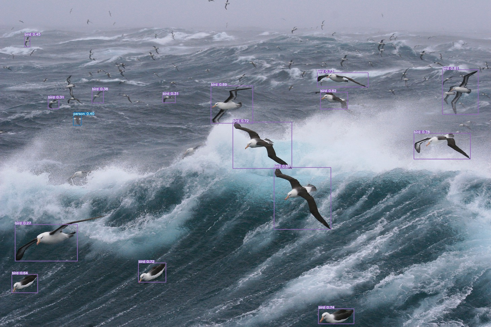
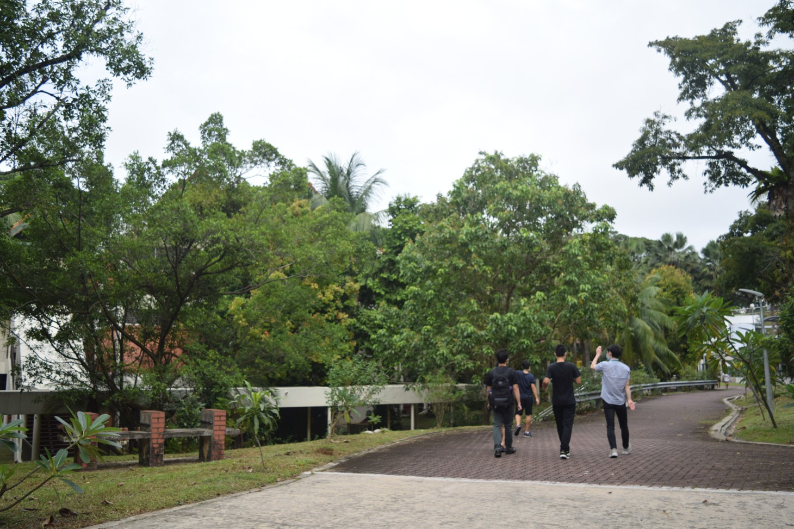
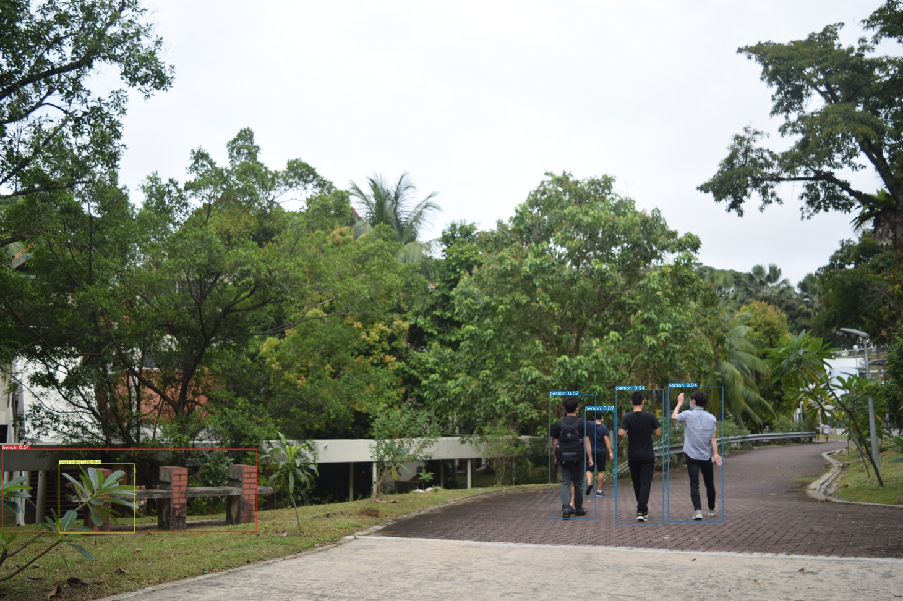
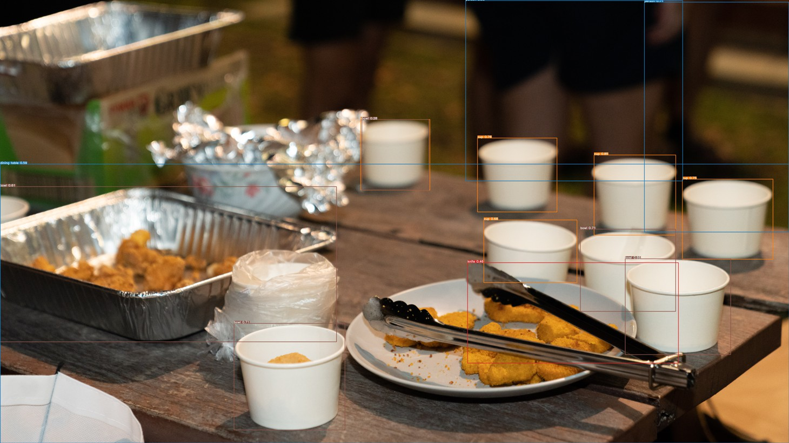

# Object Detection Tool 
###### DYM1401TT Final Assignment

#### Simple tool to detect objects in images!

##### Type of objects not restricted to enable greater flexibility and increase applicability of tool for more users.

#### Deployed site: [Object Detection Tool](http://1c098a1cb56a.ngrok.io)

## Instructions for users

##### 1. Upload the image

##### 2. Wait for the the magic to happen!

## Inference Time (with examples)

##### Sample 1

###### Before

###### After

###### Time Taken: 1.0762 sec

##### Sample 2

###### Before

###### After

###### Time Taken: 1.1706 sec

##### Sample 3

###### Before

###### After

###### Time Taken: 1.2074 sec

### Usage of Model: 

- Yolov5
  - Relatively fast and accurate model

### Tech Stack

- Google Colab
  - Good when faced with limited local storage capacity
- Streamlit
  - For easy app creation to illustrate machine learning model capabilities
- ngrok
  - For site deployment
